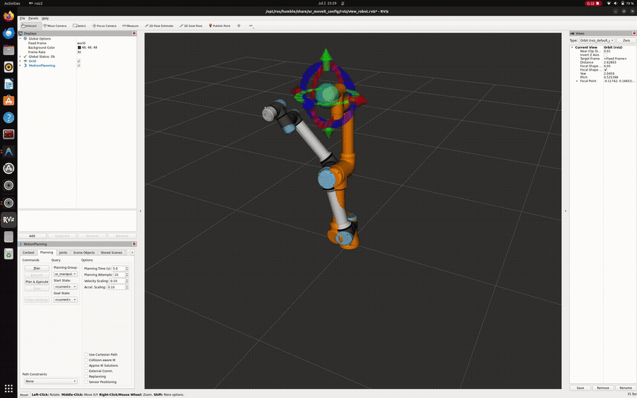
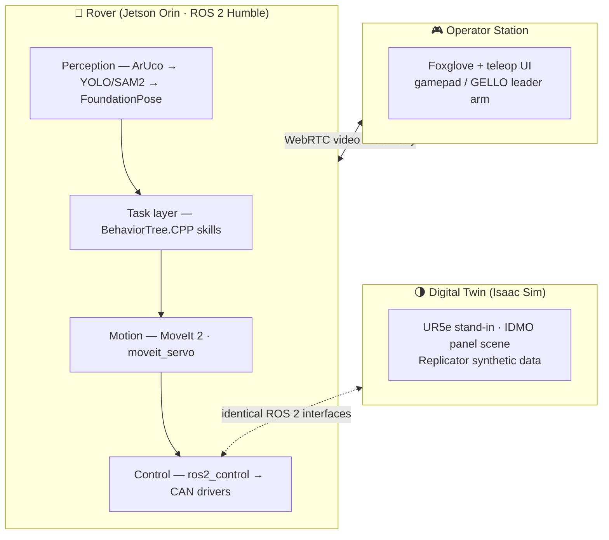
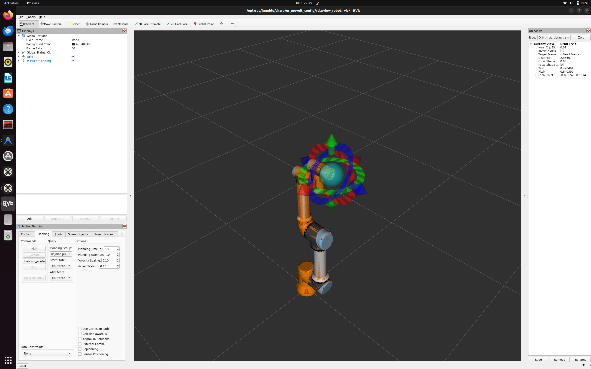
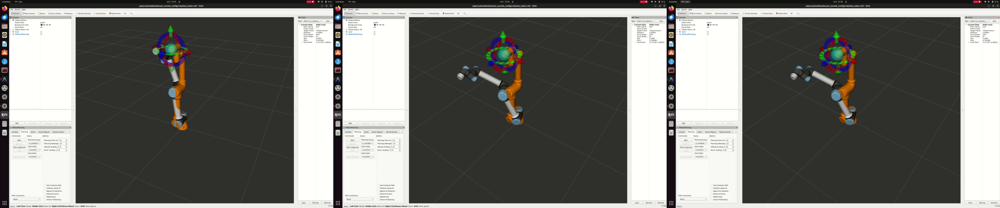

<div align="center">

# 🦾 Vanguard Arm

**Manipulation autonomy for Project Vanguard — the BITS Pilani Hyderabad Mars Rover team.**

*Built to win IRC 2027 · ARC · ERC · URC — and to publish the research along the way.*




*Day 2: a hand-built `FollowJointTrajectory` client drives the arm — no MoveIt in the loop.*

</div>

---

## What this is

The complete software stack for a rover-mounted 6-DoF manipulator: teleoperation with
assistive autonomy for competition, growing into fully autonomous panel servicing —
switches, plugs, drawers, sample caches — validated in simulation first.

Six competition-agnostic skills are the architecture's core bet:
**grasp & carry · panel ops · connector insertion · oriented placement · sampling support · read & report.**
Every rover competition's manipulation tasks are a re-orchestration of these six.



**Sim and real expose identical interfaces** — every skill runs unmodified against
Isaac Sim or hardware. The arm arrives from our mechanical team in September; the
software won't be waiting on it.

## 📸 Progress

| | |
|---|---|
|  | **First motion plan** — UR5e on mock hardware, MoveIt interactive marker, planned & executed inside the devcontainer. |
|  | **First raw trajectory** — two waypoints through the action interface directly; timing experiments + the joint-limit experiment that earned two safety design rules. |

## 📖 The Textbook

Everything we learn — theory, worked math, design decisions, and **every mistake with its
root cause** — goes into a living LaTeX book: [`docs/textbook/`](docs/textbook/)
(build: `tectonic main.tex`).

Current contents: *Part I — Build Journal* (why this stack · the stand-in arm · speaking to
controllers) + *Part II — Foundations* (rigid-body motion · product-of-exponentials FK ·
Jacobians, singularities & IK — with worked examples and problem sets).

## 🚀 Quickstart

```bash
# dev environment (Docker + NVIDIA container toolkit required)
code .   # → "Reopen in Container"

# UR5e stand-in on mock hardware (two terminals)
ros2 launch ur_robot_driver ur_control.launch.py ur_type:=ur5e \
  robot_ip:=192.168.56.101 use_fake_hardware:=true launch_rviz:=false
ros2 launch ur_moveit_config ur_moveit.launch.py ur_type:=ur5e \
  use_fake_hardware:=true launch_rviz:=true

# or skip MoveIt and speak to the controller yourself
python3 ros2_ws/src/scripts/send_trajectory.py
```

## 🗺️ Roadmap

- [x] **Phase 0a** — devcontainer · UR5e stand-in · MoveIt pipeline · raw action client
- [ ] **Phase 0b** — Isaac Sim digital twin ↔ ROS 2 bridge *(in progress)*
- [ ] **Phase 0c** — IDMO panel scene · teleop UI · six skill stubs · LeRobot data pipeline
- [ ] **Phase 1** — hardware bring-up (mech arm arrives ~Sept)
- [ ] **Phase 2** — IRC 2027 campaign 🏆
- [ ] Beyond — ARC · ERC (autonomous maintenance) · URC · 5 papers

## ⚙️ Pinned versions

| Component | Version | Why |
|---|---|---|
| Ubuntu / ROS 2 | 22.04 / Humble | Season platform; Jazzy migration scheduled post-IRC |
| Isaac Sim | **5.1.0** (standalone, `~/isaacsim`) | Current stable; official UR5e asset |
| Isaac Lab | **2.3.2** | Last stable paired with Isaac Sim 5.1 |
| RMW | CycloneDDS · `ROS_DOMAIN_ID=42` | Team-wide DDS decision (textbook §1.3) |

*Version drift requires a decisions-log entry.*

---

<div align="center">
<sub>Krithin Poola · autonomous lead, Project Vanguard · BITS Pilani Hyderabad<br/>
Krithin types all implementation code; Claude provides reference designs, review, and authors the documentation.</sub>
</div>
